# FastCampus! LangGraph, MCP, A2A 프로토콜 기반 멀티 에이전트 시스템

**멀티 에이전트 A2A 기반 주식 투자 시스템**으로,  
실시간 데이터 수집부터 리스크 관리, Human-in-the-Loop 까지 구성합니다.

---

  

---

## 주요 구성요소

### 에이전트 구성

#### **SupervisorAgent** - 마스터 오케스트레이터

- **워크플로우**: 오케스트레이터
- **핵심 기능**: 요청 분석, 에이전트 조정, 순차/병렬 실행 전략
- **특징**: LLM 기반 요청 파싱을 통한 하위 에이전트로 작업 전달

#### **DataCollectorAgent** - 통합 데이터 수집

- **워크플로우**: 8-노드 데이터 파이프라인 (수집→검증→통합→품질평가)
- **핵심 기능**: 멀티소스 데이터 수집, 품질 검증, 표준화
- **특징**: 4개 데이터 소스 통합(키움 2 + 뉴스/검색 2), 데이터 품질 점수(0.0~1.0) 계산

#### **AnalysisAgent** - 4차원 분석 엔진

- **워크플로우**: 9-노드 분석 파이프라인 (개별분석→통합→권장사항)
- **핵심 기능**: Technical, Fundamental, Macro, Sentiment 통합 분석
- **특징**: 카테고리 기반 신호 시스템, 가중평균 통합, 신뢰도 계산

#### **TradingAgent** - Human-in-the-Loop 거래

- **워크플로우**: 주식 매매 파이프라인 (전략→최적화→리스크→휴먼 승인→실행)
- **핵심 기능**: 전략 수립, 포트폴리오 최적화, VaR 기반 리스크 평가
- **특징**: Human 승인 조건부 라우팅, 실시간 모니터링

### MCP 서버 구성

#### **5개 키움증권 REST API 기반 MCP 서버**

- `kiwoom-market-mcp` (Port 8031): 실시간 시세, 차트, 순위, 기술적 지표
- `kiwoom-info-mcp` (Port 8032): 종목 정보, ETF, 테마, 기업 정보
- `kiwoom-trading-mcp` (Port 8030): 주문 관리, 계좌 정보, 거래 내역, Mock 거래
- `kiwoom-investor-mcp` (Port 8033): 기관/외국인 동향, 투자자 행동 분석
- `kiwoom-portfolio-mcp` (Port 8034): 자산 관리, VaR 계산, Sharpe ratio, 리스크 메트릭

#### **5개 외부 데이터 수집 & 분석 MCP 서버**

- `financial-analysis-mcp` (Port 8040): 재무 분석, 밸류에이션 도구
- `macroeconomic-analysis-mcp` (Port 8041): 거시경제 지표 수집·분석
- `stock-analysis-mcp` (Port 8042): 종목 기반 종합 분석 도구
- `naver-news-mcp` (Port 8050): 뉴스 수집, 감성 분석
- `tavily-search-mcp` (Port 3020): 웹 검색, 시장 동향 조사

#### **에이전트별 MCP 서버 연결 매핑**

| Agent | Connected MCP Servers | Primary Functions |
|-------|----------------------|------------------|
| **DataCollectorAgent** | kiwoom-market-mcp, kiwoom-info-mcp, naver-news-mcp, tavily-search-mcp | 멀티소스 데이터 수집, 품질 검증 |
| **AnalysisAgent** | stock-analysis-mcp, financial-analysis-mcp, macroeconomic-analysis-mcp, naver-news-mcp, tavily-search-mcp | 통합 분석, 매수-매도 신호 생성 |
| **TradingAgent** | trading-domain, portfolio-domain | 주문 실행, 리스크 관리, Human-in-the-loop |
| **SupervisorAgent** | No direct connections | 워크플로우 조정, Agent 오케스트레이션 |

## 🛠️ 기술 스택

### **Backend & AI Framework**

#### **핵심 AI 프레임워크**

- **LangGraph** 0.6.4 - 상태 기반 멀티 에이전트 워크플로우
- **LangChain** 0.3.27 - LLM 통합 및 체인 관리  
- **A2A SDK** 0.3.0 - Agent-to-Agent 통신 프로토콜

#### **MCP 서버 생태계**

- **FastMCP** 2.11.3 - 고성능 MCP 서버 프레임워크
- **langchain-mcp-adapters** 0.1.9 - LangChain-MCP 브리지

#### **데이터 & 분석**

- **pandas** 2.3.1 - 데이터 조작 및 분석
- **finance-datareader** 0.9.96 - 한국 금융 데이터 수집
- **fredapi** 0.5.2 - 미국 연방준비제도 경제 데이터
- **publicdatareader** 1.1.0 - 한국 공공데이터 통합

### **개발 환경 & 배포**

#### **런타임 & 패키지 관리**

- **Python** 3.12+ - 백엔드 런타임
- **Docker** & **Docker Compose** - 컨테이너화 배포

#### **코드 품질 & 테스팅**

- **Ruff** - Python 린터 및 포매터

### **Architecture Diagram**

```mermaid
graph TB
    subgraph "Layer 4: A2A Agent Protocol"
        A2A_Agents[A2A Agents<br/>📡 External Interface]
    end
    
    subgraph "Layer 3: A2A Integration Bridge"  
        A2A_Integration[A2A Integration<br/>🌐 Protocol Bridge]
    end
    
    subgraph "Layer 2: LangGraph Core Agents"
        LG_Agents[LangGraph Agents<br/>🤖 Core Intelligence]
    end
    
    subgraph "Layer 1: MCP Tool Ecosystem"
        MCP_Servers[MCP Servers<br/>🔧 Data & Tools]
    end
    
    A2A_Agents --> A2A_Integration
    A2A_Integration --> LG_Agents  
    LG_Agents --> MCP_Servers
```



### **Data Flow & Communication Patterns**

```mermaid
sequenceDiagram
    participant User
    participant Supervisor as SupervisorAgent
    participant DataCollector as DataCollectorAgent  
    participant Analysis as AnalysisAgent
    participant Trading as TradingAgent
    participant Human as Human-in-the-Loop
    participant MCP as MCP Servers

    User->>Supervisor: 투자 요청
    Supervisor->>DataCollector: 데이터 수집 위임
    DataCollector->>MCP: 멀티소스 데이터 수집
    MCP-->>DataCollector: Raw 데이터 반환
    DataCollector-->>Analysis: 정제된 데이터 전달
    
    Analysis->>MCP: 분석 도구 활용
    MCP-->>Analysis: 분석 결과
    Analysis-->>Trading: 투자 신호 전달
    
    Trading->>MCP: 포트폴리오 정보 조회
    MCP-->>Trading: 계좌/포지션 정보
    Trading->>Trading: 리스크 평가
    
    alt High Risk
        Trading->>Human: 승인 요청
        Human-->>Trading: 승인/거부
    end
    
    Trading->>MCP: 주문 실행
    MCP-->>Trading: 체결 결과
    Trading-->>Supervisor: 거래 완료 보고
    Supervisor-->>User: 최종 결과 전달
```



## **코드 참조**

- **[src/code_index.md](src/code_index.md)** - 전체 시스템 아키텍처 및 구조 문서

## **주요 컴포넌트별 참조 정보**

- **[LangGraph 에이전트](src/lg_agents/code_index.md)** - 4개의 Supervisor Pattern 구성의 에이전트
- **[MCP 서버](src/mcp_servers/code_index.md)** - 총 8개의 도메인별 마이크로서비스로 구성된 MCP 서버
- **[A2A 통합 레이어](src/a2a_integration/code_index.md)** - A2A-LangGraph 브리지
- **[A2A 에이전트](src/a2a_agents/code_index.md)** - A2A 프로토콜 래퍼

## 📋 설치 가이드

### 시스템 요구사항

- Python 3.12 이상
- 최신 Update 가 완료된 Docker Desktop (또는 Docker Engine 과 Docker Compose)
- 16GB 이상 RAM 권장
- 30GB 이상 디스크 여유 공간

### Docker 환경

```bash
# 1. 프로젝트 클론
git clone <repository-url>
cd project_1_stock_practice

# 2. API 키 설정 (.env 파일 편집)
cp .env.example .env
vi .env  # 필수 API 키들을 실제 값으로 변경

# 3. 전체 시스템 시작 (프로덕션 모드)
./1-run-all-services.sh

# 4. 전체 시스템 시작 (빌드 포함)
./1-run-all-services.sh build

# 5. 시스템 종료
./2-stop-all-services.sh
```

---

### 환경변수 설정

```bash
# 템플릿 파일 복사
cp .env.example .env

# .env 파일 편집하여 필수 값 설정
```

필수 환경변수:

```env
# LLM API (필수)
OPENAI_API_KEY=your_openai_api_key

# 키움증권 API (필수)
KIWOOM_APP_KEY=your_app_key
KIWOOM_APP_SECRET=your_app_secret
KIWOOM_ACCOUNT_NO=your_account_number

# TAVILY API KEY (필수)
TAVILY_API_KEY=your_tavily_key

# Naver Search API 
NAVER_CLIENT_ID=your_naver_client_id
NAVER_CLIENT_SECRET=your_naver_client_secret

# FRED API
FRED_API_KEY=your_fred_api_key

# ECOS(한국은행 경제통계시스템) API
ECOS_API_KEY=your_ecos_api_key

# DART(금융감독원 전자공시시스템) API
DART_API_KEY=your_dart_api_key
```

---

### Reference

#### A2A (Agent-to-Agent) Protocol

- [a2a-js_0.3.1.txt](docs/a2a-js_0.3.1.txt) - A2A JavaScript 프로토콜 문서 (0.3.0과 호환)
- [a2a-python_0.3.0.txt](docs/a2a-python_0.3.0.txt) - A2A Python 프로토콜 문서
- [a2a-samples_0.3.0.txt](docs/a2a-samples_0.3.0.txt) - A2A 샘플 코드 및 예제

#### LangGraph & LangChain

- [langgraph-llms_0.6.2.txt](docs/langgraph-llms_0.6.2.txt) - LangGraph 0.6.2 LLMs 통합 문서
- [langgraph-llms-full_0.6.2.txt](docs/langgraph-llms-full_0.6.2.txt) - LangGraph 0.6.2 LLMs 완전 가이드
- [langchain-llms.txt](docs/langchain-llms.txt) - LangChain LLMs 통합 문서
- [langchain-mcp-adapters.txt](docs/langchain-mcp-adapters.txt) - LangChain MCP 어댑터 문서

#### MCP (Model Context Protocol)

- [fastmcp_2.11.3_llms-full.txt](docs/fastmcp_2.11.3_llms-full.txt) - FastMCP 2.11.3 완전 가이드
- [prompt-kit-llms-full.txt](docs/prompt-kit-llms-full.txt) - Prompt Kit LLMs 완전 가이드

#### 키움증권 API 문서

- [kiwoom_rest_api_180_docs.md](docs/kiwoom_rest_api_180_docs.md) - 키움증권 REST API 180개 문서
- [kiwoom_rest_api_official_docs.pdf](docs/kiwoom_rest_api_official_docs.pdf) - 키움증권 REST API 공식 문서 (PDF)
- [kiwoom_rest_api_official_docs.xlsx](docs/kiwoom_rest_api_official_docs.xlsx) - 키움증권 REST API 공식 문서 (Excel)
