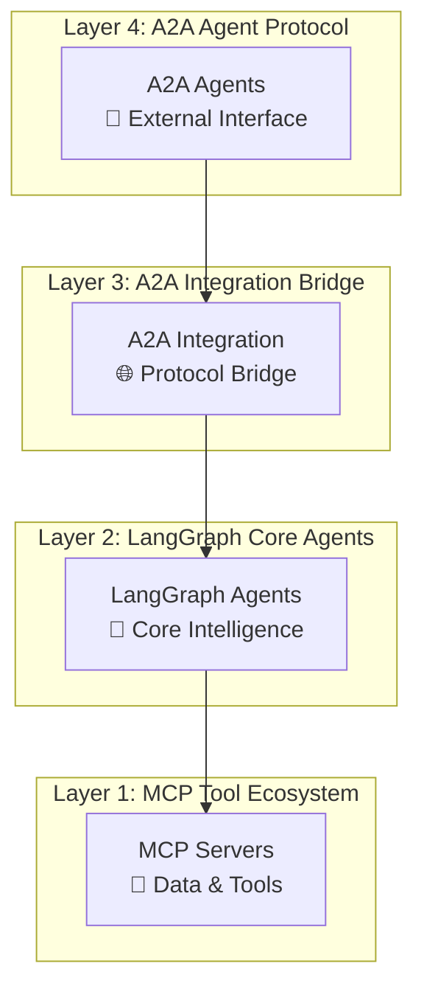
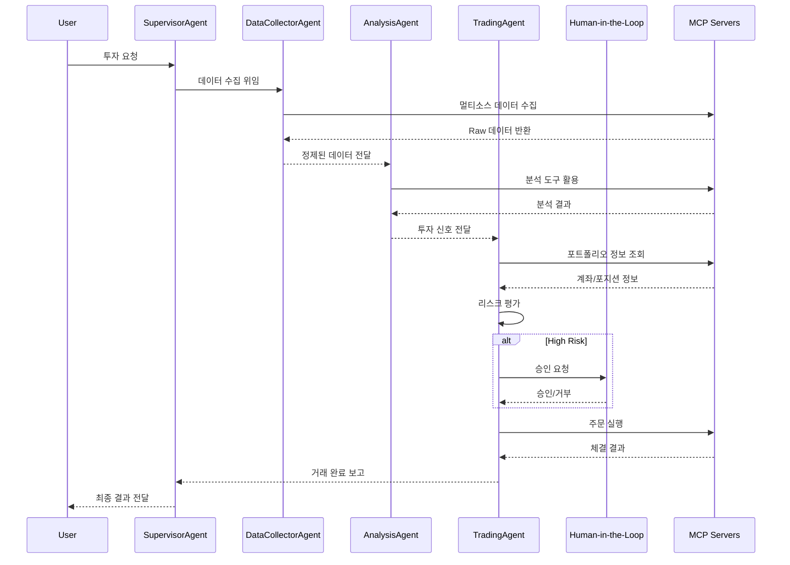

# `src` 코드 인덱스

AI 기반 주식 투자 자동화 시스템의 전체 소스코드 구조를 제공하는 최상위 인덱스 문서입니다.

## Breadcrumb

- 프로젝트 루트: [README.md](../README.md)
- **현재 위치**: `src/` - 전체 소스코드 루트

## 하위 디렉토리 코드 인덱스

- [lg_agents](lg_agents/code_index.md) - **LangGraph 기반 핵심 에이전트** (4개 핵심 Agent)
- [mcp_servers](mcp_servers/code_index.md) - **MCP 서버 구현체** (8개 도메인 서버)
- [a2a_integration](a2a_integration/code_index.md) - **A2A-LangGraph 통합 레이어**
- [a2a_agents](a2a_agents/code_index.md) - **A2A 프로토콜 기반 에이전트**

## 디렉토리 트리

```bash
src/
├── __init__.py                    # 패키지 초기화
├── code_index.md                  # 이 문서 - 전체 구조 인덱스
│
├── lg_agents/                     # 🤖 LangGraph 핵심 에이전트 (메인 로직)
│   ├── __init__.py
│   ├── supervisor_agent.py        # SupervisorAgent - 마스터 오케스트레이터
│   ├── data_collector_agent.py    # DataCollectorAgent - 통합 데이터 수집
│   ├── analysis_agent.py          # AnalysisAgent - 4차원 분석 엔진
│   ├── trading_agent.py           # TradingAgent - Human-in-the-Loop 거래
│   ├── prompts.py                 # 에이전트 프롬프트 템플릿
│   ├── util.py                    # 유틸리티 함수
│   └── base/                      # 공통 기반 클래스 및 유틸리티
│       ├── __init__.py
│       ├── base_graph_agent.py    # BaseGraphAgent 추상 클래스
│       ├── base_graph_state.py    # BaseState 상태 관리
│       ├── error_handling.py      # 에러 처리 데코레이터
│       ├── mcp_config.py          # MCP 설정 관리
│       ├── mcp_loader.py          # MCP 도구 로더
│       └── code_index.md
│
├── mcp_servers/                   # 🔧 MCP 서버 생태계
│   ├── __init__.py
│   ├── code_index.md
│   │
│   ├── kiwoom_mcp/               # 키움증권 5개 도메인 서버
│   │   ├── __init__.py
│   │   ├── code_index.md
│   │   ├── common/               # 키움 공통 컴포넌트
│   │   │   ├── __init__.py
│   │   │   ├── domain_base.py
│   │   │   ├── auth/
│   │   │   │   └── kiwoom_auth.py
│   │   │   ├── client/
│   │   │   │   ├── __init__.py
│   │   │   │   └── kiwoom_restapi_client.py
│   │   │   ├── clients/
│   │   │   │   └── kiwoom_base.py
│   │   │   ├── constants/
│   │   │   │   ├── __init__.py
│   │   │   │   ├── api_loader.py
│   │   │   │   ├── api_types.py
│   │   │   │   └── endpoints.py
│   │   │   └── api_registry/
│   │   │       └── kiwoom_api_registry.yaml
│   │   └── domains/              # 5개 도메인 서버 구현
│   │       ├── __init__.py
│   │       ├── code_index.md
│   │       ├── market_domain.py    # Port 8031: 시장 데이터
│   │       ├── info_domain.py      # Port 8032: 종목 정보
│   │       ├── trading_domain.py   # Port 8030: 거래 실행
│   │       ├── investor_domain.py  # Port 8033: 투자자 동향
│   │       └── portfolio_domain.py # Port 8034: 포트폴리오
│   │
│   ├── financial_analysis_mcp/    # Port 8040: 금융 분석 서버
│   │   ├── __init__.py
│   │   ├── code_index.md
│   │   ├── server.py
│   │   └── financial_client.py
│   │
│   ├── stock_analysis_mcp/        # 주식 기술적 분석 서버
│   │   ├── __init__.py
│   │   ├── code_index.md
│   │   ├── server.py
│   │   ├── stock_client.py
│   │   └── korean_market.py
│   │
│   ├── naver_news_mcp/           # Port 8050: 네이버 뉴스 서버
│   │   ├── __init__.py
│   │   ├── server.py
│   │   └── news_client.py
│   │
│   ├── tavily_search_mcp/        # Port 3020: 웹 검색 서버
│   │   ├── __init__.py
│   │   ├── server.py
│   │   └── tavily_search_client.py
│   │
│   ├── macroeconomic_analysis_mcp/ # 거시경제 분석 서버
│   │   ├── __init__.py
│   │   ├── server.py
│   │   └── macro_client.py
│   │
│   ├── common/                   # MCP 서버 공통 컴포넌트
│   │   ├── __init__.py
│   │   ├── README.md
│   │   ├── exceptions.py
│   │   ├── auth/
│   │   │   ├── __init__.py
│   │   │   └── kiwoom_auth.py
│   │   ├── clients/
│   │   │   ├── __init__.py
│   │   │   ├── README.md
│   │   │   ├── base_client.py
│   │   │   └── kiwoom_base.py
│   │   ├── concerns/
│   │   │   ├── __init__.py
│   │   │   ├── README.md
│   │   │   ├── cache.py
│   │   │   ├── metrics.py
│   │   │   └── rate_limit.py
│   │   └── middleware/
│   │       ├── __init__.py
│   │       ├── cors.py
│   │       ├── error_handling.py
│   │       └── logging.py
│   │
│   ├── base/                     # MCP 서버 기반 클래스
│   │   ├── __init__.py
│   │   └── base_mcp_server.py
│   │
│   └── utils/                    # 공통 유틸리티
│       ├── __init__.py
│       ├── code_index.md
│       ├── env_validator.py
│       ├── error_handler.py
│       ├── formatters.py
│       ├── market_time.py
│       ├── security.py
│       ├── serialization.py
│       └── validators.py
│
├── a2a_integration/              # 🌐 A2A-LangGraph 브리지
│   ├── __init__.py
│   ├── code_index.md
│   ├── executor.py               # LangGraphAgentExecutor
│   ├── executor_v2.py            # LangGraphAgentExecutor V2
│   ├── generic_executor.py       # 범용 실행기
│   ├── models.py                 # 설정 모델 정의
│   ├── a2a_lg_client_utils.py    # A2A 클라이언트 유틸리티
│   ├── a2a_lg_client_utils_v2.py # A2A 클라이언트 유틸 V2
│   ├── cors_utils.py             # CORS/보안 유틸리티
│   ├── a2a_lg_utils.py           # A2A 서버 빌드 유틸리티
│   └── auth/                     # 인증 모듈
│       ├── __init__.py
│       └── credentials.py        # 자격 증명 서비스
│
└── a2a_agents/                   # 📡 A2A 프로토콜 래퍼
    ├── code_index.md
    ├── base/                     # A2A 기반 클래스
    │   ├── __init__.py
    │   └── code_index.md
    ├── supervisor/               # A2A SupervisorAgent
    │   ├── __init__.py
    │   ├── __main__.py
    │   ├── code_index.md
    │   └── supervisor_agent_a2a.py
    ├── data_collector/           # A2A DataCollectorAgent
    │   ├── __init__.py
    │   ├── __main__.py
    │   ├── code_index.md
    │   └── data_collector_agent_a2a.py
    ├── analysis/                 # A2A AnalysisAgent
    │   ├── __init__.py
    │   ├── __main__.py
    │   ├── code_index.md
    │   ├── analysis_agent_a2a.py
    │   └── analysis_agent_a2a_v2.py
    └── trading/                  # A2A TradingAgent
        ├── __init__.py
        ├── __main__.py
        ├── code_index.md
        ├── trading_agent_a2a.py
        └── trading_agent_a2a_v2.py
```

## 📊 시스템 아키텍처 개요

### 🏗️ 4-Layer Architecture (현재 구현 상태)



### Core LangGraph Agents (Layer 2)

#### 1. **SupervisorAgent** (`supervisor_agent.py`)

- **역할**: 사용자 요청 분석, 워크플로우 계획, Agent 조정
- **주요 클래스**: `SupervisorAgent`, `SendSupervisorState`, `WorkflowPattern`
- **워크플로우**: 10-노드 오케스트레이션 파이프라인
- **특징**: LLM 기반 요청 파싱, 순차/병렬 실행 전략, Human 리뷰 조건 판단

#### 2. **DataCollectorAgent** (`data_collector_agent.py`)

- **역할**: 멀티소스 데이터 수집, 품질 검증, 표준화
- **주요 클래스**: `DataCollectorAgent`
- **워크플로우**: 8-노드 데이터 파이프라인 (수집→검증→통합→품질평가)
- **특징**: 5개 도메인 MCP 서버 통합, 데이터 품질 점수(0.0~1.0) 계산

#### 3. **AnalysisAgent** (`analysis_agent.py`)

- **역할**: Technical, Fundamental, Macro, Sentiment 통합 분석
- **주요 클래스**: `AnalysisAgent`
- **워크플로우**: 9-노드 분석 파이프라인 (개별분석→통합→권장사항)
- **특징**: 카테고리 기반 신호 시스템, 가중평균 통합, 신뢰도 계산

#### 4. **TradingAgent** (`trading_agent.py`)

- **역할**: 전략 수립, 포트폴리오 최적화, 리스크 평가, 주문 실행
- **주요 클래스**: `TradingAgent`
- **워크플로우**: 9-노드 거래 파이프라인 (전략→최적화→리스크→승인→실행)
- **특징**: VaR 기반 리스크 평가, Human 승인 조건부 라우팅, 실시간 모니터링

### MCP Server Ecosystem (Layer 1)

#### **5개 키움증권 도메인 서버** (`kiwoom_mcp/domains/`)

| 도메인 | 포트 | 파일 | 주요 기능 |
|--------|------|------|-----------|
| `market_domain` | 8031 | market_domain.py | 실시간 시세, 차트, 순위 |
| `info_domain` | 8032 | info_domain.py | 종목 정보, ETF, 테마 |
| `trading_domain` | 8030 | trading_domain.py | 주문 관리, 계좌 정보, 거래 내역 |
| `investor_domain` | 8033 | investor_domain.py | 기관/외국인 동향 |
| `portfolio_domain` | 8034 | portfolio_domain.py | 자산 관리, 리스크 메트릭 |

#### **외부 분석 서버**

| 서버 | 포트 | 주요 기능 |
|------|------|-----------|
| `financial_analysis_mcp` | 8040 | 재무 분석, 포트폴리오 최적화 |
| `naver_news_mcp` | 8050 | 뉴스 수집, 감성 분석 |
| `tavily_search_mcp` | 3020 | 웹 검색, 정보 수집 |
| `stock_analysis_mcp` | - | 기술적 분석 지표 계산 |
| `macroeconomic_analysis_mcp` | - | 거시경제 지표 분석 |

### A2A Integration Layer (Layer 3)

#### 핵심 컴포넌트

- **`executor.py`**: LangGraphAgentExecutor - A2A와 LangGraph 연결
- **`generic_executor.py`**: 범용 실행기 구현
- **`models.py`**: LangGraphExecutorConfig 설정 모델
- **`a2a_lg_client_utils.py`**: A2AClientManager, 에이전트 쿼리 함수
- **`a2a_lg_utils.py`**: 서버 빌드, 에이전트 카드 생성

#### 리팩토링 성과

- **Before**: 17개 파일, 5,709줄 (과도한 추상화)
- **After**: 7개 파일, 2,090줄 (63% 감소)
- **개선점**: SDK 직접 활용, 단순화된 구조, 성능 향상

### A2A Agents Layer (Layer 4)

#### A2A 프로토콜 에이전트

- **`supervisor_agent_a2a.py`**: 워크플로우 조정 A2A 래퍼
- **`data_collector_agent_a2a.py`**: 데이터 수집 A2A 래퍼
- **`analysis_agent_a2a.py`**: 분석 A2A 래퍼
- **`trading_agent_a2a.py`**: 거래 실행 A2A 래퍼

각 A2A 에이전트는 대응하는 LangGraph 에이전트를 A2A 프로토콜로 래핑하여 외부 시스템과의 통신을 가능하게 합니다.

### Data Flow & Communication Patterns



### 💫 Key Features & Innovations

#### **1. Category-Based Analysis System**

- **기존**: 수치 점수 기반 판단 (복잡, 해석 어려움)
- **현재**: 카테고리 기반 신호 (STRONG_BUY|BUY|HOLD|SELL|STRONG_SELL)
- **장점**: 명확한 의사결정, 프롬프트 간소화, 토큰 사용량 60% 감소

#### **2. Human-in-the-Loop Approval**

- **트리거**: 고위험 거래, VaR 임계치 초과, 신뢰도 낮음
- **프로세스**: 리스크 분석 → 승인 요청 → Human 판단 → 실행/취소
- **안전장치**: 타임아웃 처리, 자동 거부 조건, 감사 추적

#### **3. Real MCP Server Integration**

- **변경사항**: Mock 데이터 완전 제거 → 실제 MCP 서버 연동
- **신뢰성**: Connection pooling, 오류 복구, Health check
- **성능**: 비동기 처리, 캐싱, Rate limiting

#### **4. Ultra-Detailed Documentation**

- **Docstrings**: 모든 함수에 초상세 문서화 (목적, 입출력, 워크플로우 역할)
- **Inline Comments**: 복잡한 로직에 라인별 상세 설명
- **Communication Patterns**: Agent 간 통신 프로토콜 및 데이터 흐름 문서화

### 🛠️ Code Quality & Standards

#### **품질 개선 작업**

- **Ruff Linting**: 40개 lint 오류 수정 완료
- **Import Organization**: 모든 import 문 정렬 및 최적화
- **Code Style**: 일관된 코딩 스타일 적용
- **F-string Optimization**: 불필요한 f-string 제거

#### **문서화 완성도**

- **Ultra-detailed Docstrings**: 모든 핵심 함수 완료
- **Complex Logic Comments**: 알고리즘 로직 상세 주석
- **Architecture Documentation**: 시스템 설계 및 통신 패턴
- **Code Index System**: 계층적 코드 구조 문서

### 📈 Development Status

| Component | Implementation | Documentation | Testing | Status |
|-----------|---------------|---------------|---------|---------|
| **SupervisorAgent** | ✅ Complete | ✅ Ultra-detailed | 🔄 In Progress | 🟢 **Production Ready** |
| **DataCollectorAgent** | ✅ Complete | ✅ Ultra-detailed | 🔄 In Progress | 🟢 **Production Ready** |
| **AnalysisAgent** | ✅ Complete | ✅ Ultra-detailed | 🔄 In Progress | 🟢 **Production Ready** |
| **TradingAgent** | ✅ Complete | ✅ Ultra-detailed | 🔄 In Progress | 🟢 **Production Ready** |
| **MCP Servers** | ✅ Complete | ✅ Complete | 🔄 In Progress | 🟢 **Production Ready** |
| **A2A Integration** | ✅ Complete | ✅ Complete | 🔄 In Progress | 🟢 **Production Ready** |
| **Frontend** | ✅ Complete | ✅ Complete | 🔄 In Progress | 🟢 **Production Ready** |

### 🔧 Configuration & Environment

#### 필수 환경 변수

```bash
# OpenAI API
OPENAI_API_KEY=your-api-key

# Kiwoom API (Optional for real trading)
KIWOOM_APP_KEY=your-app-key
KIWOOM_APP_SECRET=your-app-secret
KIWOOM_ACCOUNT_NO=your-account-no

# External APIs
TAVILY_API_KEY=your-tavily-key
FRED_API_KEY=your-fred-key

# Agent Configuration
LLM_MODEL=gpt-4-turbo
HUMAN_IN_LOOP_ENABLED=true
```

#### MCP 서버 포트 매핑

```yaml
trading_domain: 8030
market_domain: 8031
info_domain: 8032
investor_domain: 8033
portfolio_domain: 8034
financial_analysis_mcp: 8040
naver_news_mcp: 8050
tavily_search_mcp: 3020
```

### 📚 Related Documentation

각 컴포넌트의 상세 문서는 해당 디렉토리의 `code_index.md` 파일을 참조하세요:

- [LangGraph Agents 상세](lg_agents/code_index.md)
- [MCP Servers 상세](mcp_servers/code_index.md)
- [A2A Integration 상세](a2a_integration/code_index.md)
- [A2A Agents 상세](a2a_agents/code_index.md)
