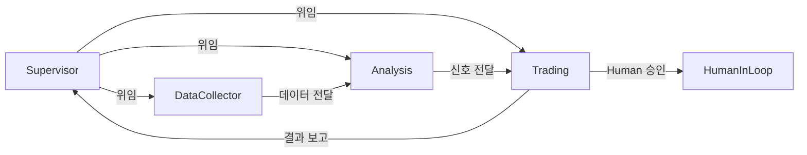

# `src/lg_agents` 코드 인덱스

LangGraph 기반 핵심 에이전트 구현체들을 포함하는 디렉토리입니다. 이 모듈은 전체 시스템의 핵심 로직을 담당합니다.

## 📋 Breadcrumb

- 프로젝트 루트: [README.md](../../README.md)
- 상위로: [src](../code_index.md)
- **현재 위치**: `src/lg_agents/` - LangGraph 에이전트

## 🗂️ 하위 디렉토리 코드 인덱스

- [📦 base](base/code_index.md) - 에이전트 기반 클래스 및 유틸리티

## 📁 디렉토리 트리

```text
lg_agents/
├── __init__.py                    # 패키지 초기화
├── code_index.md                  # 이 문서
├── supervisor_agent.py            # SupervisorAgent - 워크플로우 오케스트레이터
├── data_collector_agent.py        # DataCollectorAgent - 데이터 수집 에이전트
├── analysis_agent.py              # AnalysisAgent - 투자 분석 에이전트
├── trading_agent.py               # TradingAgent - 거래 실행 에이전트
├── prompts.py                     # 에이전트별 프롬프트 템플릿
├── util.py                        # 유틸리티 함수
└── base/                          # 기반 클래스 디렉토리
    ├── __init__.py
    ├── base_graph_agent.py        # BaseGraphAgent 추상 클래스
    ├── base_graph_state.py        # 상태 관리 TypedDict
    ├── error_handling.py          # 에러 처리 데코레이터
    ├── mcp_config.py              # MCP 설정 관리
    ├── mcp_loader.py              # MCP 도구 로더
    └── code_index.md
```

## 📊 Core LangGraph Agents

### 1️⃣ **SupervisorAgent** (`supervisor_agent.py`)

#### 주요 클래스

- `SupervisorAgent`: 메인 오케스트레이터 클래스
- `SendSupervisorState`: Supervisor에게 전송되는 상태
- `WorkflowPattern`: 워크플로우 패턴 정의 (ENUM)

#### 워크플로우 노드 (10개)

1. `initialize` - 초기화
2. `parse_request` - 사용자 요청 파싱
3. `plan_workflow` - 워크플로우 계획
4. `route_to_agent` - 에이전트 라우팅
5. `collect_data` - 데이터 수집 위임
6. `analyze` - 분석 위임
7. `trade` - 거래 위임
8. `human_review` - Human-in-the-Loop
9. `compile_results` - 결과 컴파일
10. `finalize` - 최종화

#### 주요 기능

- LLM 기반 사용자 요청 해석
- 순차/병렬 실행 전략 결정
- Agent 간 조정 및 조율
- Human 개입 필요성 판단

### 2️⃣ **DataCollectorAgent** (`data_collector_agent.py`)

#### 주요 클래스

- `DataCollectorAgent`: 데이터 수집 에이전트

#### 워크플로우 노드 (8개)

1. `initialize` - 초기화
2. `parse_request` - 요청 파싱
3. `collect_market_data` - 시장 데이터 수집
4. `collect_stock_info` - 종목 정보 수집
5. `collect_news` - 뉴스 수집
6. `validate_data` - 데이터 검증
7. `integrate_data` - 데이터 통합
8. `finalize` - 최종화

#### MCP 서버 연동

- `market_domain` (8031): 실시간 시세
- `info_domain` (8032): 종목 정보
- `investor_domain` (8033): 투자자 동향
- `naver_news_mcp` (8050): 뉴스 데이터
- `tavily_search_mcp` (3020): 웹 검색

#### 주요 기능

- 멀티소스 데이터 수집
- 데이터 품질 점수 계산 (0.0~1.0)
- 데이터 표준화 및 정제
- 실시간/배치 데이터 처리

### 3️⃣ **AnalysisAgent** (`analysis_agent.py`)

#### 주요 클래스

- `AnalysisAgent`: 투자 분석 에이전트

#### 워크플로우 노드 (9개)

1. `initialize` - 초기화
2. `prepare_data` - 데이터 준비
3. `technical_analysis` - 기술적 분석
4. `fundamental_analysis` - 기본적 분석
5. `sentiment_analysis` - 감성 분석
6. `macro_analysis` - 거시경제 분석
7. `integrate_analysis` - 분석 통합
8. `generate_recommendations` - 투자 권장사항 생성
9. `finalize` - 최종화

#### 분석 방법론

- **Technical**: RSI, MACD, Bollinger Bands, 이동평균
- **Fundamental**: PER, PBR, ROE, 부채비율
- **Sentiment**: 뉴스 감성, 투자자 심리
- **Macro**: GDP, 금리, 환율, 경제지표

#### 시그널 시스템

- 카테고리 기반: `STRONG_BUY | BUY | HOLD | SELL | STRONG_SELL`
- 가중평균 통합 점수
- 신뢰도 계산 (0.0~1.0)

### 4️⃣ **TradingAgent** (`trading_agent.py`)

#### 주요 클래스

- `TradingAgent`: 거래 실행 에이전트

#### 워크플로우 노드 (9개)

1. `initialize` - 초기화
2. `strategy_formation` - 전략 수립
3. `portfolio_optimization` - 포트폴리오 최적화
4. `risk_assessment` - 리스크 평가
5. `human_approval` - Human 승인 (조건부)
6. `order_preparation` - 주문 준비
7. `order_execution` - 주문 실행
8. `monitor_execution` - 실행 모니터링
9. `finalize` - 최종화

#### MCP 서버 연동

- `trading_domain` (8030): 주문 실행
- `portfolio_domain` (8034): 포트폴리오 관리

#### 리스크 관리

- VaR (Value at Risk) 계산
- 포지션 사이즈 최적화
- 손절/익절 전략
- Human-in-the-Loop 트리거

#### Human-in-the-Loop 조건

- 고위험 거래 (VaR > 임계값)
- 대규모 포지션 변경
- 신뢰도 낮은 신호
- 시스템 이상 감지

## 🔧 공통 컴포넌트

### **base/** 디렉토리

#### `base_graph_agent.py`

- `BaseGraphAgent`: 모든 에이전트의 추상 기반 클래스
- StateGraph 빌드 메서드
- 공통 노드 구현
- 에러 처리 로직

#### `base_graph_state.py`

- `BaseState`: 기본 상태 TypedDict
- 공통 상태 필드 정의
- 상태 전이 관리

#### `mcp_loader.py`

- MCP 도구 동적 로딩
- 도구 레지스트리 관리
- 도구 검증 및 초기화

#### `mcp_config.py`

- MCP 서버 설정 관리
- 포트 매핑
- 환경 변수 로드

#### `error_handling.py`

- 에러 처리 데코레이터
- 재시도 로직
- 에러 로깅

### **prompts.py**

- 에이전트별 시스템 프롬프트
- 태스크 프롬프트 템플릿
- Few-shot 예제

### **util.py**

- 공통 유틸리티 함수
- 데이터 변환 헬퍼
- 시간대 처리
- 포맷팅 함수

## 🔄 Agent 간 통신 패턴



## 📝 상태 관리

각 에이전트는 `TypedDict` 기반 상태를 관리합니다:

```python
class AgentState(TypedDict):
    messages: List[BaseMessage]  # 대화 히스토리
    task: str                    # 현재 작업
    data: Dict[str, Any]          # 수집된 데이터
    analysis: Dict[str, Any]      # 분석 결과
    recommendations: List[Dict]   # 권장사항
    errors: List[str]             # 에러 메시지
    metadata: Dict[str, Any]      # 메타데이터
```

## 🎯 사용 예시

```python
# SupervisorAgent 사용
from src.lg_agents.supervisor_agent import SupervisorAgent

supervisor = SupervisorAgent()
result = await supervisor.graph.ainvoke({
    "messages": [HumanMessage(content="삼성전자 투자 분석 해줘")]
})

# DataCollectorAgent 사용
from src.lg_agents.data_collector_agent import DataCollectorAgent

collector = DataCollectorAgent()
data = await collector.graph.ainvoke({
    "stock_code": "005930",
    "data_types": ["market", "news", "investor"]
})
```

## 🔗 관련 문서

- [Base 클래스 상세](base/code_index.md)
- [MCP 서버 연동](../mcp_servers/code_index.md)
- [A2A 통합](../a2a_integration/code_index.md)
